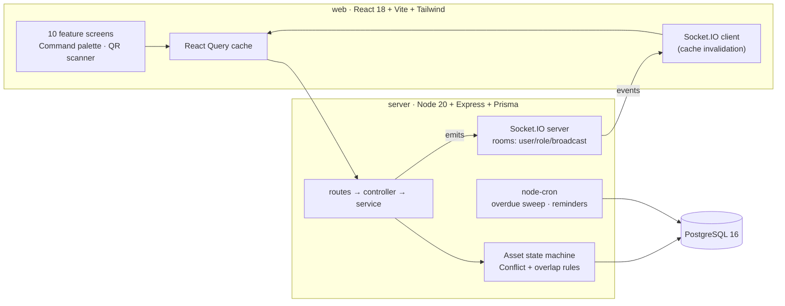

# AssetFlow — Enterprise Asset & Resource Management System

A full-stack ERP for tracking, allocating, and maintaining physical assets and shared resources.
Built for any organization — offices, schools, hospitals, factories — with structured asset
lifecycles, conflict-safe allocation, overlap-free booking, an approval-driven maintenance
workflow, structured audit cycles, and a live KPI dashboard.

> **Out of scope by design:** purchasing, invoicing, accounting. Acquisition cost is stored for
> ranking/reports only.

---

## ✨ Highlights

- **Double-allocation prevention** — you cannot allocate an asset that's already held; the system
  blocks it, names the current holder, and offers a **Transfer Request** instead.
- **Overlap-free booking** — two people can't book the same resource at overlapping times;
  back-to-back slots are allowed.
- **Approval-driven maintenance** — a drag-and-drop Kanban (Pending → Approved → Technician
  Assigned → In Progress → Resolved); the asset flips to *Under Maintenance* on approval and back on
  resolution — enforced by a server-side state machine.
- **Audit cycles** — assign auditors, verify each asset (Verified / Missing / Damaged), auto-generate
  a discrepancy report, and close the cycle (missing → **Lost**, damaged → auto maintenance request).
- **Realtime everywhere (Socket.IO)** — open two windows side by side and watch KPIs, the Kanban,
  the calendar, and the notification bell update **instantly**.
- **QR codes** — every asset has a printable QR label; a global scanner jumps to any asset, and an
  **audit-mode scanner** lets an auditor walk around marking assets with a phone.
- **Command palette (⌘/Ctrl-K)** — fuzzy jump to any screen, search assets by tag, run quick actions.
- **Role-based access** — signup only ever creates an *Employee*; an Admin promotes roles in the
  Employee Directory (the single source of truth for roles).

---

## 🧱 Architecture



**Layering rule:** `routes → controller → service → prisma`. All business rules live in services,
every mutation writes an `ActivityLog` and emits socket events where relevant, all inputs are
validated with Zod, and the centralized error handler always returns `{ error: { code, message, details? } }`.

**Monorepo:**
```
assetflow/
├── docker-compose.yml
├── server/   # Express + Prisma API, Socket.IO, cron, seed
└── web/      # React + Vite SPA
```

---

## 🚀 Run it

### Option A — Docker (one command)

```bash
docker compose up --build
```

- Web → http://localhost:5173
- API → http://localhost:4000
- The API container runs `prisma migrate deploy` + seed automatically on first boot.

### Option B — Local dev (no Docker for the apps)

You need a PostgreSQL 16 instance. The fastest way is just the DB in Docker:

```bash
docker run -d --name assetflow-pg -e POSTGRES_USER=assetflow -e POSTGRES_PASSWORD=assetflow \
  -e POSTGRES_DB=assetflow -p 5432:5432 postgres:16-alpine
```

**Server:**
```bash
cd server
cp .env.example .env
npm install
npx prisma migrate dev --name init   # creates tables
npm run prisma:seed                   # loads the demo org
npm run dev                           # http://localhost:4000
```

**Web:**
```bash
cd web
cp .env.example .env
npm install
npm run dev                           # http://localhost:5173
```

> Reset to a pristine demo at any time: `cd server && npm run db:reset`.

---

## 🔑 Demo logins

Four seeded demo accounts (one per role: **Admin**, **Asset Manager**, **Department Head**,
**Employee**) are available as **one-click buttons on the login screen**. These accounts exist purely
for the demo video — no other purpose. Credentials are intentionally not listed here; just use the
one-click buttons after seeding.

---

## 🧩 Feature → screen map

| # | Screen | Notes |
|---|---|---|
| 1 | Login / Signup | Signup = Employee only; forgot-password token printed to server console |
| 2 | Dashboard | 6 KPI cards, separate overdue strip, quick actions, live activity |
| 3 | Organization Setup | Departments, Categories (custom fields), Employee Directory (role assignment) |
| 4 | Assets | Search/filter, register (photo, custom fields, bookable), detail + QR + lifecycle timeline |
| 5 | Allocation & Transfer | Conflict block, transfer approval queue, return flow, overdue highlighting |
| 6 | Resource Booking | Week calendar, overlap validation, cancel/reschedule |
| 7 | Maintenance | dnd-kit Kanban, workflow + state machine enforced server-side |
| 8 | Audit | Cycles, checklist, scan-to-verify, discrepancy report + CSV, close consequences |
| 9 | Reports | Utilization, maintenance trend, most-used/idle, due-soon, dept summary, heatmap, CSV export |
| 10 | Activity & Notifications | Filter tabs, live notifications, full audit log |

---

## 🔒 Security & quality

- TypeScript strict on both packages · Helmet · CORS locked to web origin · bcrypt (10 rounds) ·
  JWT 24h · Zod on every route · role checks enforced **server-side** · image uploads ≤ 5 MB.
- Multi-step mutations (transfer approval, audit close) run inside Prisma `$transaction`.
- Asset tag generation is race-safe (atomic counter + unique constraint).

## 🛠 Tech stack

**Frontend:** React 18, Vite, TailwindCSS, React Router, TanStack Query, Zustand, Recharts,
Framer Motion, lucide-react, react-hot-toast, socket.io-client, qrcode.react, html5-qrcode,
date-fns, @dnd-kit.
**Backend:** Node 20, Express, Prisma, Socket.IO, jsonwebtoken, bcryptjs, Zod, Multer, node-cron.
**Database:** PostgreSQL 16. **Infra:** Docker + docker-compose.
